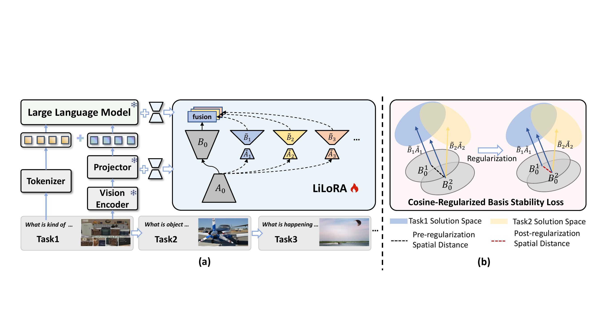

# LoRA in LoRA: Towards Parameter-Efficient Architecture Expansion for Continual Visual Instruction Tuning

LiLoRA is a parameter-efficient architecture expansion method for continual visual instruction tuning. It shares LoRA components across tasks while preserving task-specific adaptation through a lightweight low-rank branch. 



## Benchmark install

The CVIT benchmark constructed by SMoLoRA encompasses 10 datasets along with their corresponding instruction sets.

### Instruction Tuning Files

You can download instruction tuning files of the CVIT benchmark from [CVIT benchmark](https://huggingface.co/datasets/zackie29/SMoLoRA).

### Dataset Images

All datasets used in the benchmark are publicly available. You can download the corresponding images directly from each dataset's official website.

## Model Preparation

Please download the pretrained language model [vicuna-7b-v1.5](https://huggingface.co/lmsys/vicuna-7b-v1.5), the [alignment module](https://huggingface.co/liuhaotian/llava-v1.5-mlp2x-336px-pretrain-vicuna-7b-v1.5), and the [CLIP vision tower](https://huggingface.co/openai/clip-vit-large-patch14-336) in advance.

## Training and Evaluation

### Install

```bash
git clone https://github.com/chanceche/LiLoRA.git
cd LiLoRA
conda create -n lilora python=3.10 -y
conda activate lilora
pip install --upgrade pip
pip install -e .
```

Edit the path configuration block at the top of the scripts before training or evaluation:

```bash
scripts/LiLoRA/Train/Train_all.sh
scripts/LiLoRA/Eval/eval_all.sh
```

### Training and Eval

Run continual visual instruction tuning:

```bash
bash scripts/LiLoRA/Train/Train_all.sh
```

Run evaluation:

```bash
bash scripts/LiLoRA/Eval/eval_all.sh
```

Evaluate a single task by passing a checkpoint path:

```bash
bash scripts/LiLoRA/Eval/1_eval_sqa.sh \
  <checkpoint_path>
```

## Acknowledgement

Our project is based on [LLaVA](https://github.com/haotian-liu/LLaVA), [PEFT](https://github.com/huggingface/peft), and [SMoLoRA](https://github.com/Minato-Zackie/SMoLoRA). We sincerely thank them for their outstanding contributions.

## License

This project is released under the Apache License 2.0. See [LICENSE](LICENSE) for details.
